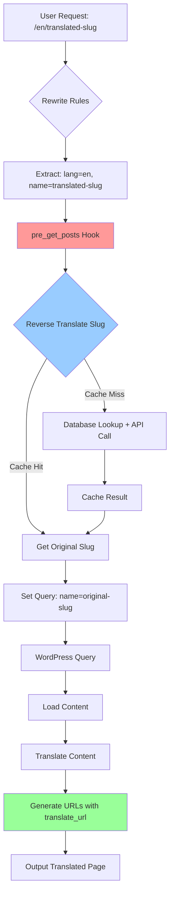

# Analyse en Implementatie Slug Vertaling met AI Translate Plugin

Deze plugin, `ai-translate`, heeft een geavanceerde URL-structuur met taalcode prefixes (`/langcode/slug`), maar **vertaalt momenteel geen slugs**. De huidige implementatie voegt alleen taalcode prefixes toe aan bestaande URLs zonder de slug-inhoud te vertalen.

## Huidige Implementatie Analyse

### URL Vertaling (`translate_url` methode)

De [`translate_url()`](includes/class-ai-translate-core.php:1936) methode in de `AI_Translate_Core` class is verantwoordelijk voor URL-aanpassingen:

**Huidige functionaliteit:**
1. **URL Parsing:** Parseert de inkomende URL met `wp_parse_url()`
2. **Taalcode Detectie:** Detecteert bestaande taalcode prefixes in het pad (bijv. `/en/`, `/de/`)
3. **Prefix Management:** Verwijdert bestaande prefixes en voegt nieuwe toe
4. **URL Reconstructie:** Bouwt de URL opnieuw op met het juiste taalcode prefix

**Belangrijke beperking:** De functie vertaalt **alleen het taalcode prefix**, niet de slug zelf.

### Rewrite Rules Implementatie

De plugin heeft uitgebreide rewrite rules in [`add_language_rewrite_rules()`](ai-translate.php:591):

```php
// Custom post types
add_rewrite_rule('^([a-z]{2})/service/([^/]+)/?$', 'index.php?lang=$matches[1]&post_type=service&name=$matches[2]', 'top');
add_rewrite_rule('^([a-z]{2})/product/([^/]+)/?$', 'index.php?lang=$matches[1]&post_type=product&name=$matches[2]', 'top');

// Pages/posts met taalprefix
add_rewrite_rule('^' . $lang_regex . '/(.+?)/?$', 'index.php?lang=$matches[1]&pagename=$matches[2]', 'top');
add_rewrite_rule('^' . $lang_regex . '/([^/]+)/?$', 'index.php?lang=$matches[1]&name=$matches[2]', 'top');
```

**Probleem:** Deze rules verwachten vertaalde slugs in de URL, maar er is geen mechanisme om inkomende vertaalde slugs terug te vertalen naar originele slugs voor WordPress query's.

### URL Filter Integratie

De plugin integreert met WordPress permalink filters:
- [`post_link` filter](ai-translate.php:496) - voor posts
- [`page_link` filter](ai-translate.php:510) - voor pagina's
- Menu item URL's via [`wp_nav_menu_objects`](ai-translate.php:60)

**Status:** Werkt correct voor taalcode prefixes, maar geen slug vertaling.

## Implementatieplan voor Slug Vertaling

### Fase 1: URL Generatie (Uitgaande Links)

#### 1.1 Uitbreiding van `translate_url()` methode

**Locatie:** [`includes/class-ai-translate-core.php:1936`](includes/class-ai-translate-core.php:1936)

**Huidige implementatie:**
```php
public function translate_url(string $url, string $language): string
{
    // Alleen taalcode prefix management
    // Geen slug vertaling
}
```

**Benodigde uitbreidingen:**

1. **Content Identificatie:**
   ```php
   // Gebruik url_to_postid() voor basis identificatie
   $post_id = url_to_postid($url);
   
   // Fallback: parse URL voor custom post types
   if (!$post_id) {
       $post_id = $this->identify_post_from_url($url);
   }
   ```

2. **Slug Extractie en Vertaling:**
   ```php
   if ($post_id) {
       $post = get_post($post_id);
       $original_slug = $post->post_name;
       
       // Vertaal slug met bestaande translate_text methode
       $translated_slug = $this->translate_text(
           $original_slug,
           $this->default_language,
           $language,
           true, // is_title = true voor slugs
           true  // use_disk_cache = true
       );
       
       // Sanitize voor URL gebruik
       $translated_slug = sanitize_title($translated_slug);
   }
   ```

3. **URL Reconstructie:**
   ```php
   // Vervang originele slug met vertaalde slug in het pad
   $new_path = str_replace($original_slug, $translated_slug, $clean_path);
   ```

#### 1.2 Nieuwe Helper Methoden

**Benodigde nieuwe methoden in `AI_Translate_Core`:**

```php
/**
 * Identificeer post ID uit URL voor custom post types
 */
private function identify_post_from_url(string $url): int

/**
 * Vertaal slug specifiek voor URL gebruik
 */
private function translate_slug(string $slug, string $target_language): string

/**
 * Cache voor slug vertalingen (apart van content cache)
 */
private function get_cached_slug_translation(string $slug, string $language): ?string
private function cache_slug_translation(string $slug, string $language, string $translation): void
```

### Fase 2: Inkomende URL Afhandeling (404 Fix)

#### 2.1 Pre-Query Modificatie

**Implementatie:** Nieuwe `pre_get_posts` hook in [`ai-translate.php`](ai-translate.php)

```php
add_action('pre_get_posts', function($query) {
    if (!$query->is_main_query() || is_admin()) {
        return;
    }
    
    $lang = get_query_var('lang');
    if (!$lang) {
        return;
    }
    
    $core = AI_Translate_Core::get_instance();
    
    // Voor pagina's
    if ($pagename = get_query_var('pagename')) {
        $original_slug = $core->reverse_translate_slug($pagename, $lang);
        if ($original_slug) {
            $query->set('pagename', $original_slug);
        }
    }
    
    // Voor posts
    if ($name = get_query_var('name')) {
        $original_slug = $core->reverse_translate_slug($name, $lang);
        if ($original_slug) {
            $query->set('name', $original_slug);
        }
    }
});
```

#### 2.2 Reverse Translation Systeem

**Nieuwe methode in `AI_Translate_Core`:**

```php
/**
 * Vertaal slug terug naar originele taal
 * Gebruikt cache en database lookup
 */
public function reverse_translate_slug(string $translated_slug, string $from_language): ?string
{
    // 1. Check cache voor reverse mapping
    $cache_key = "reverse_slug_{$from_language}_{$translated_slug}";
    $cached = get_transient($cache_key);
    if ($cached !== false) {
        return $cached;
    }
    
    // 2. Database query naar posts met matching vertaalde slug
    // 3. Valideer door slug opnieuw te vertalen
    // 4. Cache resultaat
}
```

### Fase 3: Database Schema Uitbreidingen

#### 3.1 Slug Translation Cache Table

**Optionele optimalisatie:** Dedicated tabel voor slug vertalingen

```sql
CREATE TABLE wp_ai_translate_slugs (
    id bigint(20) NOT NULL AUTO_INCREMENT,
    post_id bigint(20) NOT NULL,
    original_slug varchar(200) NOT NULL,
    translated_slug varchar(200) NOT NULL,
    language_code varchar(10) NOT NULL,
    created_at datetime DEFAULT CURRENT_TIMESTAMP,
    updated_at datetime DEFAULT CURRENT_TIMESTAMP ON UPDATE CURRENT_TIMESTAMP,
    PRIMARY KEY (id),
    UNIQUE KEY unique_translation (post_id, language_code),
    KEY idx_translated_slug (translated_slug, language_code),
    KEY idx_original_slug (original_slug)
);
```

#### 3.2 Integration met Bestaande Cache Systeem

**Uitbreiding van cache management:**
- Nieuwe cache type: `slug_trans` voor slug-specifieke vertalingen
- Integration met [`clear_cache_for_language()`](includes/class-ai-translate-core.php:1468)


### Fase 4: Technische Overwegingen en Edge Cases

#### 4.1 Performance Optimalisaties

**Caching Strategie:**
- **Reverse Lookup Cache:** Cache voor vertaalde slug → originele slug mapping
- **Memory Cache:** In-request caching voor herhaalde slug lookups

**Database Optimalisatie:**
```php
// Batch slug translation voor menu's en lijsten
public function batch_translate_slugs(array $slugs, string $target_language): array
{
    // Gebruik bestaande batch_translate_items() logica
    // Maar dan specifiek voor slugs met URL sanitization
}
```

#### 4.2 Edge Cases en Speciale Situaties

**1. Homepage en Statische Pagina's:**
```php
// Speciale behandeling voor front page
if (is_front_page() || is_home()) {
    // Geen slug vertaling, alleen taalcode prefix
    return $this->add_language_prefix($url, $language);
}
```

**2. Custom Post Types:**
```php
// Uitbreiding van bestaande rewrite rules
add_rewrite_rule(
    '^([a-z]{2})/service/([^/]+)/?$',
    'index.php?lang=$matches[1]&post_type=service&name=$matches[2]',
    'top'
);
```

**3. Taxonomie URLs:**
```php
// Nieuwe functionaliteit voor category/tag URLs
public function translate_taxonomy_url(string $url, string $language): string
{
    // Vertaal zowel taxonomy slug als term slug
}
```

#### 4.3 Compatibiliteit en Integratie

**Bestaande Plugin Integratie:**
- **SEO Plugins:** Yoast, RankMath - canonical URL handling
- **Caching Plugins:** WP Rocket, W3 Total Cache - cache invalidation
- **Page Builders:** Elementor, Gutenberg - shortcode handling

**Theme Compatibiliteit:**
```php
// Uitbreiding van bestaande shortcode exclusion
private static function get_always_excluded_shortcodes(): array
{
    return [
        'mb_btn', 'mb_col', 'mb_heading', // Bestaande
        'elementor-template', 'et_pb_section', // Page builders
        'woocommerce_cart', 'contact-form-7' // E-commerce/Forms
    ];
}
```

### Fase 5: Implementatie Roadmap

#### 5.1 Prioriteit 1 (Kritiek)
1. **`pre_get_posts` Hook:** Fix voor 404 errors
2. **Basis Slug Vertaling:** Uitbreiding `translate_url()` voor posts/pages
3. **Reverse Translation:** `reverse_translate_slug()` methode

#### 5.2 Prioriteit 2 (Belangrijk)
1. **Custom Post Types:** Service, Product URL handling
2. **Caching Optimalisatie:** Dedicated slug cache
3. **Admin Interface:** Slug translation management

#### 5.3 Prioriteit 3 (Wenselijk)
1. **Database Schema:** Dedicated slug translation table
2. **Batch Processing:** Menu en lijst optimalisaties
3. **Advanced Features:** Taxonomy URL translation

### Technische Risico's en Mitigaties

#### Risico 1: Performance Impact
**Probleem:** Extra API calls voor slug vertaling
**Mitigatie:**
- Agressieve caching strategie
- Batch processing waar mogelijk
- Lazy loading van slug vertalingen

#### Risico 2: URL Conflicts
**Probleem:** Vertaalde slugs kunnen conflicteren met bestaande content
**Mitigatie:**
- Slug uniqueness validation
- Fallback naar originele slug + taalcode suffix
- Conflict detection en resolution

#### Risico 3: SEO Impact
**Probleem:** Wijzigende URL structuur kan SEO beïnvloeden
**Mitigatie:**
- Proper canonical URL implementation
- 301 redirects voor oude URLs
- Sitemap updates met nieuwe URL structuur

### Ervaringen uit Eerdere Implementatie Pogingen

**Compatibiliteit Issues:**
- **Custom Post Types:** Service/Product shortcodes vereisen speciale aandacht
- **Theme Integration:** Layout problemen door vertaalde content filtering
- **CSS Conflicts:** Thumbnails en styling issues na content vertaling

**Kritieke Lessen:**
- **`pre_get_posts` is essentieel** voor 404 fix - hoogste prioriteit
- **Grondige testing** vereist voor alle custom post types en shortcodes
- **Caching strategie** moet slug vertalingen apart behandelen van content

### Conclusie en Aanbevelingen

**Huidige Status:** De AI Translate plugin heeft een solide basis voor taalcode prefix management, maar mist slug vertaling functionaliteit.

**Kritieke Implementatie Stappen:**
1. **Onmiddellijk:** Implementeer `pre_get_posts` hook voor 404 fix
2. **Kort termijn:** Uitbreid `translate_url()` met basis slug vertaling
3. **Middellange termijn:** Optimaliseer met dedicated caching en batch processing

**Verwachte Impact:**
- **Positief:** Volledig gelokaliseerde URLs, betere UX, SEO voordelen
- **Risico's:** Performance overhead, complexiteit, potentiële conflicts

**Aanbeveling:** Implementeer in fases met uitgebreide testing op staging omgeving, beginnend met de kritieke 404 fix via `pre_get_posts` hook.

## Mermaid Diagram: Slug Translation Flow



**Legenda:**
- 🔴 Kritieke implementatie (pre_get_posts)
- 🔵 Caching optimalisatie
- 🟢 URL generatie uitbreiding

